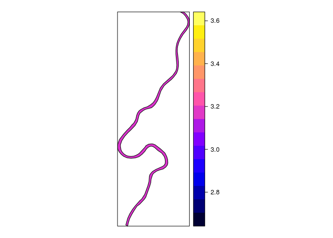

<!-- README.md is generated from README.Rmd. Please edit that file -->
<table style="width:49%;">
<colgroup>
<col width="11%" />
<col width="18%" />
<col width="6%" />
<col width="12%" />
</colgroup>
<thead>
<tr class="header">
<th align="left">Branch</th>
<th align="left">Build status</th>
<th align="left">Code</th>
<th align="left">coverage</th>
</tr>
</thead>
<tbody>
<tr class="odd">
<td align="left">Master</td>
<td align="left"><a href="https://app.wercker.com/project/bykey/bd4930c4d92c16decdde4d37c735a894"></a></td>
<td align="left"><a href="https://codecov.io/github/emarginatus/geoversion?branch=master"></a></td>
<td align="left"></td>
</tr>
<tr class="even">
<td align="left">Develop</td>
<td align="left"><a href="https://app.wercker.com/project/bykey/bd4930c4d92c16decdde4d37c735a894"></a></td>
<td align="left"><a href="https://codecov.io/github/emarginatus/geoversion?branch=develop"></a></td>
<td align="left"></td>
</tr>
</tbody>
</table>

Store spatial objects from the sp package into a database while maintaining the version history. A specific version of the spatial object can be retrieved.

Convert a `SpatialPolygonsDataFrame` object into a `geoVersion` object
======================================================================

``` r
library(sp)
data(meuse.riv)
meuse.sr <- SpatialPolygonsDataFrame(
  SpatialPolygons(
    list(
      Polygons(list(Polygon(meuse.riv)), "meuse.riv")
    )
  ),
  data = data.frame(StableID = 5, Name = "Meuse", Extra = pi),
  match.ID = FALSE
)
spplot(meuse.sr, zcol = "Extra")
```

<!-- -->

``` r
library(geoversion)
gv <- convert(object = meuse.sr, stable.id = "StableID")
str(gv)
#> Formal class 'geoVersion' [package "geoversion"] with 7 slots
#>   ..@ Coordinates   :'data.frame':   176 obs. of  4 variables:
#>   .. ..$ hash : chr [1:176] "8fe1c17f7b29f8555421c44ade5d0e9446d165d2" "8fe1c17f7b29f8555421c44ade5d0e9446d165d2" "8fe1c17f7b29f8555421c44ade5d0e9446d165d2" "8fe1c17f7b29f8555421c44ade5d0e9446d165d2" ...
#>   .. ..$ order: int [1:176] 1 2 3 4 5 6 7 8 9 10 ...
#>   .. ..$ x    : num [1:176] 182004 182137 182252 182314 182332 ...
#>   .. ..$ y    : num [1:176] 337679 337570 337414 337285 337122 ...
#>   ..@ Feature       :'data.frame':   1 obs. of  2 variables:
#>   .. ..$ hash: chr "8fe1c17f7b29f8555421c44ade5d0e9446d165d2"
#>   .. ..$ type: chr "S"
#>   ..@ Features      :'data.frame':   1 obs. of  2 variables:
#>   .. ..$ hash   : chr "52d1e681d7fdffab0e106291c5cf18901ebb4f41"
#>   .. ..$ feature: chr "8fe1c17f7b29f8555421c44ade5d0e9446d165d2"
#>   ..@ LayerElement  :'data.frame':   1 obs. of  2 variables:
#>   .. ..$ id      : num 5
#>   .. ..$ features: chr "52d1e681d7fdffab0e106291c5cf18901ebb4f41"
#>   ..@ Attribute     :'data.frame':   2 obs. of  3 variables:
#>   .. ..$ name: chr [1:2] "Name" "Extra"
#>   .. ..$ type: chr [1:2] "factor" "numeric"
#>   .. ..$ id  : chr [1:2] "9a50b0ca483d9444fad290d5c1882f1b8aeccc0f" "a341ec94cc373bb508700eb81f6858490ccb6a07"
#>   ..@ AttributeValue:'data.frame':   2 obs. of  3 variables:
#>   .. ..$ element  : num [1:2] 5 5
#>   .. ..$ attribute: chr [1:2] "9a50b0ca483d9444fad290d5c1882f1b8aeccc0f" "a341ec94cc373bb508700eb81f6858490ccb6a07"
#>   .. ..$ value    : chr [1:2] "Meuse" "3.14159265358979"
#>   ..@ CRS           :Formal class 'CRS' [package "sp"] with 1 slot
#>   .. .. ..@ projargs: chr NA
```

Convert a `geoVersion` object in to a `SpatialPolygonsDataFrame`
================================================================

``` r
gv.sp <- as_sp(gv)
str(gv.sp)
#> Formal class 'SpatialPolygonsDataFrame' [package "sp"] with 5 slots
#>   ..@ data       :'data.frame':  1 obs. of  3 variables:
#>   .. ..$ ID   : num 5
#>   .. ..$ Extra: num 3.14
#>   .. ..$ Name : chr "Meuse"
#>   ..@ polygons   :List of 1
#>   .. ..$ :Formal class 'Polygons' [package "sp"] with 5 slots
#>   .. .. .. ..@ Polygons :List of 1
#>   .. .. .. .. ..$ :Formal class 'Polygon' [package "sp"] with 5 slots
#>   .. .. .. .. .. .. ..@ labpt  : num [1:2] 180183 331123
#>   .. .. .. .. .. .. ..@ area   : num 2122714
#>   .. .. .. .. .. .. ..@ hole   : logi FALSE
#>   .. .. .. .. .. .. ..@ ringDir: int 1
#>   .. .. .. .. .. .. ..@ coords : num [1:176, 1:2] 182004 182137 182252 182314 182332 ...
#>   .. .. .. ..@ plotOrder: int 1
#>   .. .. .. ..@ labpt    : num [1:2] 180183 331123
#>   .. .. .. ..@ ID       : chr "52d1e681d7fdffab0e106291c5cf18901ebb4f41"
#>   .. .. .. ..@ area     : num 2122714
#>   ..@ plotOrder  : int 1
#>   ..@ bbox       : num [1:2, 1:2] 178304 325698 182332 337685
#>   .. ..- attr(*, "dimnames")=List of 2
#>   .. .. ..$ : chr [1:2] "x" "y"
#>   .. .. ..$ : chr [1:2] "min" "max"
#>   ..@ proj4string:Formal class 'CRS' [package "sp"] with 1 slot
#>   .. .. ..@ projargs: chr NA
spplot(gv.sp, zcol = "Extra")
```

<!-- -->
